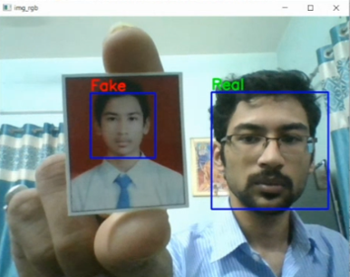

# Face Liveness Detection (Face Anti-spoofing / Face Presentation Attack Detection):  

- Built an AI model that determines whether the face of the person sitting in front of the webcam is Real or Fake by using Transfer Learning and TSBTC (Thepade’s Sorted Bock Truncation Encoding).

- The model consistes of two parts:
    1. Feature extractor:  
        a. Deep learning based feature extractor: Finetuned VGG19  
        b. Handcrafted feature extractor        : TSBTC-10 ary (Thepade's Sorted Block Truncation Encoding)  
    3. Classifier:  
         Decision Tree    

- Created model is robust to Photo attack, video attack, warped photo attack, etc.

---   
\
**Steps to run the code**:  

1. Install the necessary dependancies:
```
pip install -r requirements.txt
```

2. Run the file:
```
python DL_TSBTC_clf_video_testing.py
```
\
**Output Screenshots**:  

1. Photo attack:
    <div align="center">
      
    </div>  
\
2. HD photo attack:
    <div align="center">
      
    </div>
\
3. Video attack:
    <div align="center">
      
    </div>
\
4. Curve photo attack:
    <div align="center">
      
    </div>
\
    <div align="center">
      
    </div>

\
**The corresponding research paper**: [paper](https://www.ije.ir/article_161610.html)  
```
@article {
    author = {Thepade, S. D. and Dindorkar, M. R. and Chaudhari, P. R. and Bang, S. V.},
    title = {Enhanced Face Presentation Attack Prevention Employing Feature Fusion of Pre-trained Deep Convolutional Neural Network Model and Thepade's Sorted Block Truncation Coding},
    journal = {International Journal of Engineering},
    volume = {36},
    number = {4},
    pages = {807-816}
}
```
